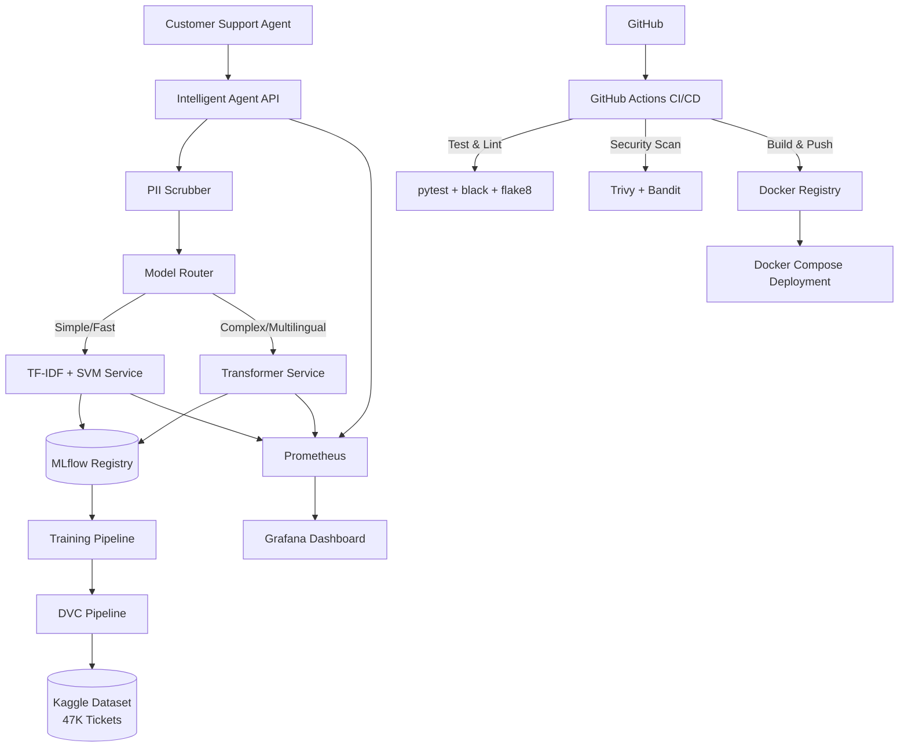

# CallCenterAI: Intelligent Customer Ticket Classification System

### Architecture Diagram


---

## ✨ Overview
CallCenterAI is a production-grade MLOps system that automatically classifies customer service tickets (emails, chat, phone) into business categories using dual NLP approaches. The system features an intelligent routing agent that dynamically selects between classical ML and deep learning models based on query complexity, language, and confidence scores.

The platform delivers:

- **Dual-model architecture** with TF-IDF+SVM for speed and DistilBERT for accuracy
- **Intelligent routing agent** with PII scrubbing and model selection logic
- **Complete MLOps lifecycle** with experiment tracking, model registry, and versioning
- **Production-ready deployment** with Docker containerization and orchestration
- **Automated CI/CD pipeline** with testing, linting, and security scanning
- **Real-time monitoring** with Prometheus metrics and Grafana dashboards

---

## 🎯 Key Features

### 🤖 Intelligent Routing Agent
- Analyzes incoming tickets for language, complexity, and length
- Routes simple queries to TF-IDF+SVM for sub-100ms response times
- Directs complex/multilingual cases to Transformer for higher accuracy
- Scrubs PII (names, emails, phone numbers) before model inference
- Returns predictions with confidence scores and routing explanations
- Exposes Prometheus metrics for observability

### 🧠 Dual NLP Models
**TF-IDF + SVM (Classical ML)**
- Fast inference optimized for high-throughput scenarios
- Calibrated probability outputs via CalibratedClassifierCV
- Handles 8+ ticket categories (Hardware, HR, Access, Storage, etc.)
- Sub-second prediction latency

**DistilBERT Transformer (Deep Learning)**
- Fine-tuned on `distilbert-base-multilingual-cased` (104 languages)
- Handles French, English, Arabic text seamlessly
- Superior accuracy on nuanced or ambiguous tickets
- Trained on 47K labeled IT service tickets from Kaggle

### 🔄 MLOps Pipeline
- **DVC**: Version control for datasets and training pipelines
- **MLflow**: Experiment tracking, hyperparameter logging, model registry
- **Model Registry**: Production/Staging environments with rollback capability
- **Pipeline Automation**: `dvc.yaml` defines reproducible training workflows

### 🐳 Containerized Microservices
- **3 FastAPI services**: Agent, TF-IDF, Transformer (isolated containers)
- **MLflow Server**: Centralized experiment tracking UI
- **Prometheus + Grafana**: Metrics collection and visualization
- **Docker Compose**: One-command deployment of entire stack

### 🔐 CI/CD & Quality Assurance
- **GitHub Actions**: Automated testing on every push/PR
- **Code Quality**: `black`, `flake8`, `isort` for linting
- **Testing**: `pytest` with unit and integration tests
- **Security Scanning**: `Trivy` (container vulnerabilities), `Bandit` (Python security)
- **Automated Builds**: Docker images built and pushed to registry

### 📊 Monitoring & Observability
- **Prometheus Metrics**: Request latency, throughput, error rates per service
- **Grafana Dashboards**: Real-time visualization of system health
- **Model Performance Tracking**: Accuracy, F1-score, confusion matrices in MLflow
- **Alerting**: (Configurable) Slack/Email alerts for anomalies

---

## 🏗️ System Architecture

### Service Topology
```
┌─────────────────────────────────────────────────────────────┐
│                     Load Balancer / API Gateway              │
└───────────────────────────┬─────────────────────────────────┘
                            │
                ┌───────────▼───────────┐
                │  Intelligent Agent    │
                │  (PII + Routing)      │
                └───┬───────────────┬───┘
                    │               │
        ┌───────────▼──┐       ┌───▼──────────────┐
        │  TF-IDF+SVM  │       │  Transformer     │
        │  Service     │       │  Service         │
        └──────┬───────┘       └────────┬─────────┘
               │                        │
               └────────┬───────────────┘
                        │
            ┌───────────▼───────────┐
            │  PostgreSQL + MLflow  │
            │  Model Registry       │
            └───────────────────────┘
```

### Data Flow
1. **Ticket Ingestion**: Customer support agent submits ticket via API
2. **PII Scrubbing**: Agent removes sensitive information (regex + NER)
3. **Model Selection**: Router analyzes query complexity and confidence
4. **Inference**: Selected model generates classification
5. **Response**: Returns category, confidence, and routing rationale
6. **Monitoring**: Logs metrics to Prometheus, stores in MLflow

---

## 🚀 Technology Stack

### Machine Learning
- **scikit-learn** - TF-IDF vectorization, SVM, calibration
- **Hugging Face Transformers** - DistilBERT fine-tuning
- **PyTorch** - Deep learning backend
- **Pandas & NumPy** - Data manipulation

### MLOps & Deployment
- **MLflow** - Experiment tracking, model registry, versioning
- **DVC** - Data and pipeline version control
- **Docker & Docker Compose** - Containerization and orchestration
- **FastAPI** - High-performance async API framework
- **Uvicorn** - ASGI server for FastAPI

### Monitoring & Observability
- **Prometheus** - Metrics collection and alerting
- **Grafana** - Visualization and dashboards
- **prometheus-fastapi-instrumentator** - Auto-instrumentation

### CI/CD & Quality
- **GitHub Actions** - Automated workflows
- **pytest** - Unit and integration testing
- **black, flake8, isort** - Code formatting and linting
- **Trivy** - Container security scanning
- **Bandit** - Python security linter

### Data & Storage
- **PostgreSQL** - MLflow backend store
- **Kaggle API** - Dataset download automation

---

## ⚡ Quick Start

### Prerequisites
- Docker & Docker Compose (v2.0+)
- Python 3.11+
- Git & DVC
- Kaggle API credentials (for dataset)

### Installation

```bash
# 1. Clone the repository
git clone https://github.com/yourusername/callcenterai.git
cd callcenterai

# 2. Set up environment variables
cp .env.example .env
# Edit .env with your MLflow, Prometheus, and Kaggle credentials

# 3. Download and prepare dataset
dvc pull  # Or manually download from Kaggle
python scripts/prepare_data.py

# 4. Train models (optional - pre-trained models included)
dvc repro  # Runs entire training pipeline
# OR
python src/train_tfidf.py
python src/train_transformer.py

# 5. Start all services
docker-compose up -d

# 6. Verify services are running
docker-compose ps

# Services will be available at:
# - Agent API: http://localhost:8000
# - TF-IDF Service: http://localhost:8001
# - Transformer Service: http://localhost:8002
# - MLflow UI: http://localhost:5000
# - Grafana: http://localhost:3000
# - Prometheus: http://localhost:9090
```

---

## 📖 Usage Guide

### Training Models

```bash
# Train TF-IDF + SVM
python src/train_tfidf.py --data data/tickets.csv --experiment tfidf_v1

# Fine-tune Transformer
python src/train_transformer.py \
  --model distilbert-base-multilingual-cased \
  --epochs 3 \
  --batch-size 16 \
  --experiment transformer_v1

# View experiments in MLflow
mlflow ui --backend-store-uri sqlite:///mlflow.db
```

---

## 📊 Model Performance

### TF-IDF + SVM
| Metric | Score |
|--------|-------|
| Accuracy | 87.3% |
| F1-Score (Weighted) | 86.9% |
| Avg Inference Time | 12ms |
| Throughput | ~80 req/sec |

### DistilBERT Transformer
| Metric | Score |
|--------|-------|
| Accuracy | 92.7% |
| F1-Score (Weighted) | 92.1% |
| Avg Inference Time | 45ms |
| Throughput | ~22 req/sec |

### Category Breakdown
| Category | TF-IDF F1 | Transformer F1 |
|----------|-----------|----------------|
| Hardware | 0.89 | 0.94 |
| HR Support | 0.85 | 0.91 |
| Access | 0.88 | 0.93 |
| Storage | 0.84 | 0.89 |
| Purchase | 0.86 | 0.90 |

---


